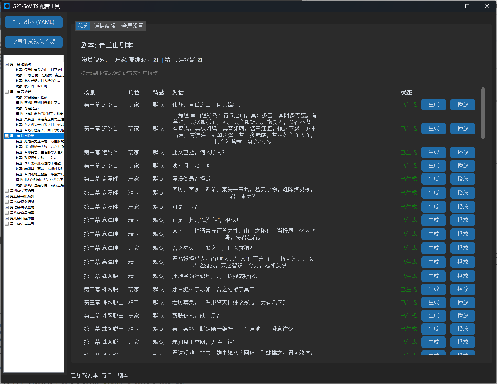
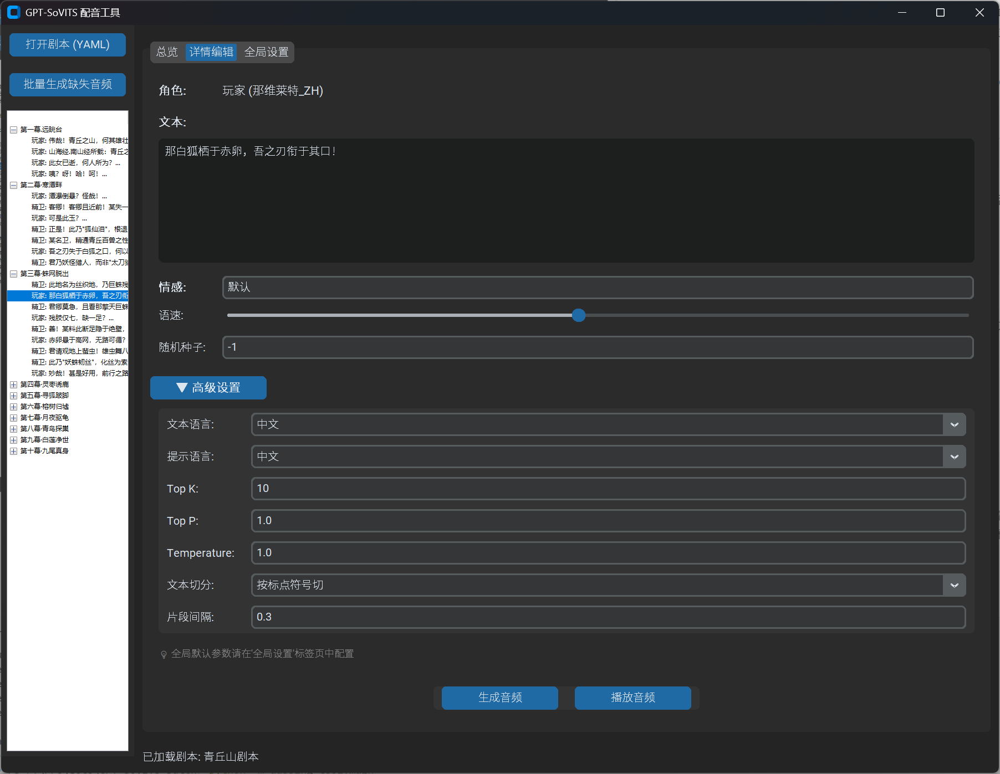

# GPT-SoVITS 批量配音工具

一个基于 GPT-SoVITS 的剧本批量配音生成工具，支持 YAML 格式剧本解析、角色映射配置、批量音频生成和简易图形界面。

## 项目简介

本工具是基于 [GPT-SoVITS](https://github.com/RVC-Boss/GPT-SoVITS) 项目和 [GPT-SoVITS-Inference](https://github.com/AI-Hobbyist/GPT-SoVITS-Inference) 推理整合项目的二次开发，通过调用 [GPT-SoVITS-Inference](https://github.com/AI-Hobbyist/GPT-SoVITS-Inference) 提供的 Infer 接口，专门用于批量处理剧本配音任务。通过友好的图形界面和灵活的配置系统，让用户能够高效地为长篇剧本生成高质量的语音内容。

项目运行基于 GPT-SoVITS-Inference 后端，本地/云端 部署可参考 [GPT-SoVITS-Inference 部署文档](https://www.yuque.com/baicaigongchang1145haoyuangong/ib3g1e)

## 功能特性

### 🎭 剧本管理
- **YAML 格式支持**：结构化的剧本格式，支持场景、角色、对话、情感等元数据
- **角色映射配置**：每个剧本可独立配置角色与模型的映射关系
- **场景化组织**：按场景分类管理对话，便于长篇剧本处理

### 🎨 现代化界面
- **三标签页设计**：
  - 总览页面：显示剧本信息、演员映射和所有对话的生成状态
  - 详情编辑：单条对话的精细化编辑和参数调整
  - 全局设置：API 配置和默认参数管理
- **实时状态显示**：直观显示音频生成状态（已生成/缺失）
- **一键操作**：支持批量生成、单条生成、即时播放

### ⚙️ 高级参数控制
- **分层参数体系**：
  - 常用参数：语速、随机种子（详情页面直接显示）
  - 高级参数：语言设置、生成参数、文本切分等（可折叠区域）
  - 全局参数：批处理、采样步数、重复惩罚等（专门设置页面）
- **参数持久化**：自动保存生成参数到 JSON 元数据文件
- **灵活配置**：支持单条对话的个性化参数调整

### 🔊 音频处理
- **智能文件组织**：按剧本名称和场景自动分类存储音频文件
- **元数据记录**：完整记录生成参数，便于复现和调试
- **内置播放器**：使用 Windows 内置音频播放，无需额外依赖
- **格式支持**：支持 WAV、MP3、FLAC 等多种音频格式

### 🖥️ 界面展示





## 安装使用

### 环境要求
- Python 3.8+
- Windows 系统（音频播放功能）
- GPT-SoVITS API 服务

### 依赖安装
```bash
pip install -r requirements.txt
```

### 配置文件
编辑 `config.yaml` 文件：
```yaml
api:
  base_url: http://127.0.0.1:8000  # GPT-SoVITS-Inference API 地址

inference_defaults:
  # 默认推理参数
  text_lang: 中文
  prompt_text_lang: 中文
  speed_facter: 1.0
  # ... 其他参数
```

### 剧本格式
创建 YAML 格式的剧本文件：（建议基于原始格式剧本使用AI快速生成）
```yaml
script_name: "示例剧本"
character_models:
  角色A: "模型名称_A"
  角色B: "模型名称_B"

scenes:
  - scene_name: "第一场"
    dialogues:
      - character: "角色A"
        text: "对话内容"
        emotion: "默认"
      - character: "角色B"
        text: "回应内容"
        emotion: "高兴（要求模型存在相关参考情感文件）"
```

### 启动程序
```bash
python -m dubbing_tool.main
```

## 项目结构

```
GPT-SoVITS-Batch/
├── dubbing_tool/           # 主程序包
│   ├── __init__.py
│   ├── main.py            # 程序入口
│   ├── gui.py             # 图形界面
│   ├── api_client.py      # API 客户端
│   ├── script_parser.py   # 剧本解析器
│   └── utils.py           # 工具函数
├── raw_scripts/           # 原始剧本文件
├── output/               # 生成的音频文件
├── config.yaml           # 配置文件
├── requirements.txt      # 依赖列表
└── README.md            # 项目说明
```

## 使用流程

1. **配置 API**：在全局设置中配置 GPT-SoVITS API 地址
2. **准备剧本**：创建 YAML 格式的剧本文件，配置角色映射
3. **加载剧本**：在界面中打开剧本文件
4. **检查配置**：在总览页面查看演员映射和对话状态
5. **生成音频**：
   - 批量生成：一键生成所有缺失的音频
   - 单条生成：在详情页面或总览页面生成特定对话
6. **试听调整**：播放生成的音频，根据需要调整参数重新生成

## 致谢声明

本项目基于以下开源项目和贡献者的工作进行二次开发：

### 基础项目
- **原始项目**：[GPT-SoVITS](https://github.com/RVC-Boss/GPT-SoVITS) - 1分钟语音数据即可训练出优秀的TTS模型
- **推理整合项目**：[GPT-SoVITS-Inference](https://github.com/AI-Hobbyist/GPT-SoVITS-Inference) - 专为推理优化的整合包

### 原始项目开发者

- GPT-Sovits开发者：[@花儿不哭](https://space.bilibili.com/5760446)
- 模型训练者：[@红血球AE3803](https://space.bilibili.com/6589795) [@白菜工厂1145号员工](https://space.bilibili.com/518098961)
- 推理特化整合包制作：[@AI-Hobbyist](https://github.com/AI-Hobbyist)

### 相关资源
- **整合包下载**：[ModelScope 仓库](https://www.modelscope.cn/models/aihobbyist/GPT-SoVITS-Inference/files)
- **项目文档**：[语雀文档](https://www.yuque.com/baicaigongchang1145haoyuangong/ib3g1e)
- **模型分享社区**：[AI-Hobbyist](https://www.ai-hobbyist.com/)

### 额外鸣谢

- **需求方/文档提供**: [@Bernkastel592746](https://space.bilibili.com/39357696)

感谢所有为 GPT-SoVITS 项目做出贡献的开发者和社区成员！
